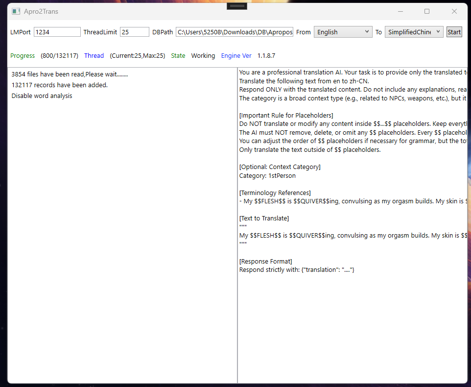

# Apro2Trans

⚠️ **Warning: This project contains adult content (NSFW)! For users aged 18 and above only.**

Apro2Trans is a translation tool specifically designed for the **Apropos 2 mod**. It uses a local AI model (LMStudio) to automatically translate mod text content, making it easier for users to enjoy content that is originally available only in certain languages.



## Usage Guide

Usage: Enter the path to be translated in DBPath.  
Example:  
C:\Users\52508\Downloads\DB\Apropos2.1.0.0.10 - DB ONLY - NO INCEST\Apropos2

Set the From field to the source language of Apropos2, and the To field to the language you want to translate to.  
Click Start.

It's important to note that after translating the first few thousand entries, close the software.  
Use a database viewing tool; some fields may require adjustment, even with AI translation, because these fields have inherent uncertainties and ambiguities. Some words may also be obscure.  
(They are mainly of the Synonyms type. Please see the following tutorial.)

You can view the translated database (Engine.db in the software's root directory, database type SQLite3) using any database viewing tool.

### SQL Queries

Enter the SQL command to match all Synonyms:
```sql
SELECT * FROM CloudTranslation
WHERE Key LIKE '%\Apropos2\Apropos\db\Synonyms.txt%'
```

Here you can manually adjust the value of the column named Result.  
The software will ultimately use the results from the database as the final output.

Match by specified category:
```sql
SELECT * FROM CloudTranslation
WHERE Key LIKE '%\Apropos2\Apropos\db\Synonyms.txt-ACCEPTING%'
```

After processing, open the software and re-run the translation.